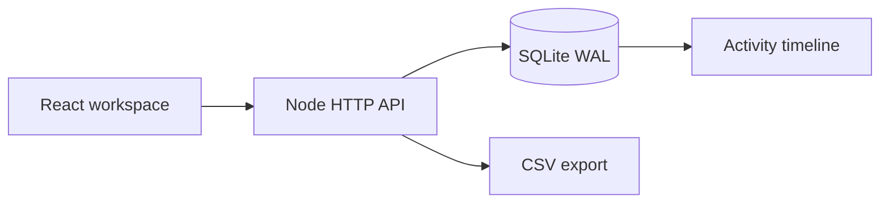

# ApplyFlow

A single-user application workspace for tracking opportunities from saved to accepted. React handles the pipeline and timeline; a Node.js API stores durable records in SQLite.

## Run it

Requires **Node.js 24+** (uses built-in `node:sqlite`).

```sh
npm ci
npm run seed       # optional, clearly labeled synthetic opportunities
npm run build
npm start
# Open http://127.0.0.1:3101
```

For development, run `npm run server` and `npm run dev` in separate terminals. Vite proxies `/api` to port 3101. `npm test` runs the API and persistence tests.

## What works

- Search and filter opportunities by company, role, location, and workflow stage.
- Schedule follow-ups with a due queue using UTC calendar dates.
- Move applications through validated stages. Skipping directly from saved to offer is rejected.
- Record notes and stage/date changes in a chronological activity timeline.
- Detect stale edits using integer versions and return an actionable conflict.
- Export quoted CSV with spreadsheet-formula protection.
- Preserve records across restarts, with atomic application/event writes.



## Engineering decisions

[API contract](server/README.md) · [Design and trade-offs](docs/architecture.md)

The data layer uses prepared statements, foreign keys, transactions, and optimistic concurrency. The HTTP boundary limits JSON bodies to 32 KB, checks origins/hosts, returns structured errors, and serves the built UI from the same origin.

`DB_PATH` defaults to `data/applications.db`; `PORT` defaults to 3101. `HOST` defaults to loopback. `APP_ORIGIN` can set an explicit trusted origin.

```sh
docker compose up --build
```

The Compose service uses a non-root process, a read-only root filesystem, a named data volume, and a health check. The Docker definition is included for reproducible packaging; local verification covers the Node runtime. CI also builds the image.

## Verification

Six automated tests cover workflow rejection, audit ordering, version conflicts, input validation, restart persistence, CSV escaping, and HTTP responses. GitHub Actions runs the tests, frontend build, and container build on pushes and pull requests.

## Scope and provenance

This is a portfolio application for **one local user**, not a hosted recruiting system. There is no authentication or tenant isolation. Add those, HTTPS, request throttling, backups, and paginated queries before a shared deployment. Synchronous SQLite is intentional for this small workload; no throughput claim is made.

This repository evolved from a React job-listing exercise. The earlier implementation remains in Git history; the workflow engine, persistence, tests, and workspace are the current project. Seed records are fictional, not claims of actual applications or employment.
